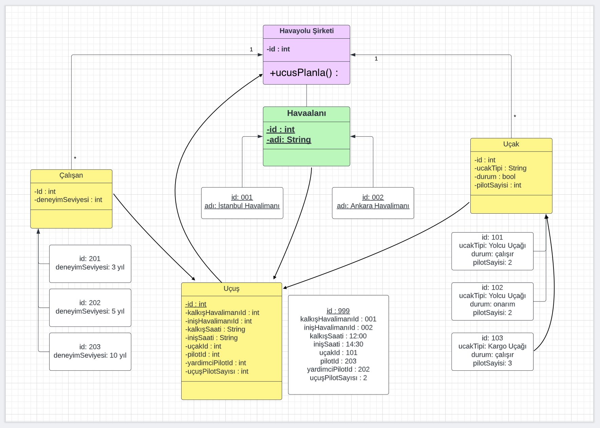

# Object Oriented Programming Ödev - Uçuş Yönetim Sistemi

**İSTEM:** Uçuşların ve pilotların yönetimi için bir sistem tasarlayın.

    * Hava yolu şirketleri uçuşları gerçekleştirir. Her hava yolunun bir kimliği vardır.
    * Hava yolu şirketi, farklı tipteki uçaklara sahiptir.
    * Uçaklar çalışır veya onarım durumunda olabilir.
    * Her uçuşun benzersiz kimliği, kalkacağı ve ineceği havaalanı, kalkış ve iniş saatleri vardır.
    * Her uçuşun bir pilotu ve yardımcı pilotu vardır ve uçağı kullanırlar.
    * Havaalanlarının benzersiz kimlikleri ve isimleri vardır.
    * Hava yolu şirketlerinin pilotları vardır ve her pilotun bir deneyim seviyesi mevcuttur.
    * Bir uçak tipi, belirli sayıda pilota ihtiyaç duyabilir.

_Bu sistemi tasvir eden Class(Sınıf) diyagramını çiziniz._

---
**CEVAP:**

