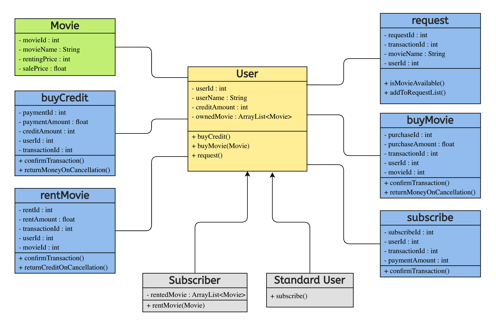

# Object Oriented Programming Ödev - Online Film Sistemi

**İSTEM:** Online film satan veya kiralayan uygulamanın sistemini tasarlayın.

    * Uygulamada filmler listelenebilir, sıralanabilir ve kullanıcılar uygulamaya abone olabilir.
    * Kullanıcılar abonelik için sistem üzerinden kredi satın alır.
    * Sadece abone olan kullanıcılar, kredileri ile film kiralayabilir ve kiraladığı filmin kredi bedeli kadar hesabından düşülür.
    * Normal kullanıcılar ve aboneler film satın alabilirler.
    * Eğer film mevcut değil ise talep edilebilir.

_Bu sistemi tasvir eden Class(Sınıf) diyagramını çiziniz._

---
**CEVAP:**

